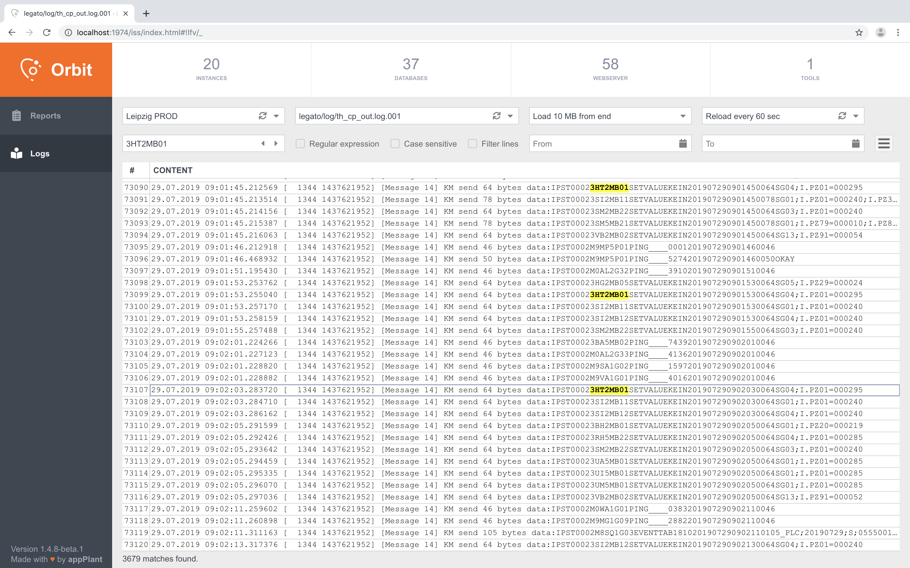

# Web Frontend for _[iss][iss]_

More screenshots can be found [here][screenshots]

## Features

- Render report results generated with [ski][ski]
- Load files and search, filter or export their content

## Prerequisites

- Install [Sencha Cmd](https://www.sencha.com/products/sencha-cmd) (^6.7.0)
- Download [Sencha Ext JS](https://www.sencha.com/products/extjs) (^6.2.1) and
 extract it into a `"sencha-sdks"` folder in your home directory

## Development

Clone the repo:
    
    $ git clone https://github.com/appplant/orbit-web.git && cd orbit-web/

Install the SDK:

    $ sencha app install ~/sencha-sdks

Upgrade the Font Awesome icons:

    $ (cd packages/local/font-awesome && sencha package build)

And then execute:

    $ sencha app watch

Open your browser on http://localhost:1841

## Contributing

Bug reports and pull requests are welcome on GitHub at https://github.com/appplant/orbit-web.

1. Fork it
2. Create your feature branch (`git checkout -b my-new-feature`)
3. Commit your changes (`git commit -am 'Add some feature'`)
4. Push to the branch (`git push origin my-new-feature`)
5. Create new Pull Request

## License

The code is available as open source under the terms of the [GPL-3.0 License][license].

Made with :heart: in Leipzig

© 2016 [appPlant GmbH][appplant]

[iss]: https://github.com/appplant/iss
[screenshots]: https://github.com/appplant/orbit-web/tree/master/resources/screenshots
[ski]: https://github.com/appplant/ski
[license]: http://opensource.org/licenses/GPL-3.0
[appplant]: www.appplant.de
